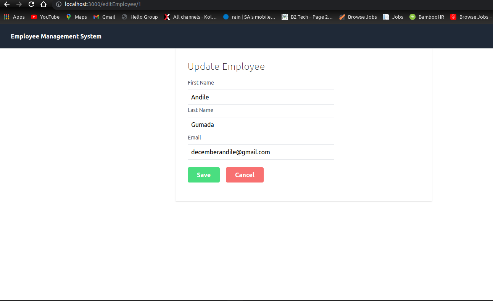

# Reactjs, Spring boot and MySQL Web Application - Expense Tracker

A simple expense tracking application built with Angular 9 and Spring boot that connects to the MySQL database. Application built using spring data JPA to perform database operations. Users can add, list, update, delete, sort, and filter the expenses.

## Requirements

1. Java - 1.8.x

2. Maven - 3.x.x

3. Mysql - 5.x.x

4. React - 18.2.x.x

5. Node - 12.x.x

6. Npm - 6.x.x
````
## Steps to Setup

**1. Clone the application**

```
git clone https://github.com/scbushan05/angular9-springboot-expensetracker.git
```

**2. Create Mysql database**
```
create database emsdb
```

**3. Change mysql username and password as per your installation**

+ open `src/main/resources/application.properties`

+ change `spring.datasource.username` and `spring.datasource.password` as per your mysql installation

**4. Build and run the app using maven (employee)**

```
mvn package
java -jar target/employee-.jar
```

Alternatively, you can run the app without packaging it using -

```
mvn spring-boot:run
```

The app will start running at <http://localhost:8081>.

## Explore Rest APIs

The app defines following CRUD APIs.

    GET /api/expenses

    POST /api/employees

    GET /api/employees/{id}
    
    PUT /api/employees/{id}

    DELETE /api/employees/{id}

You can test them using postman or any other rest client.

**5. Install node modules for React application (employee-ui)**

```bash
npm install
```

**6. Run the React application**

```
bash
ng start

```



